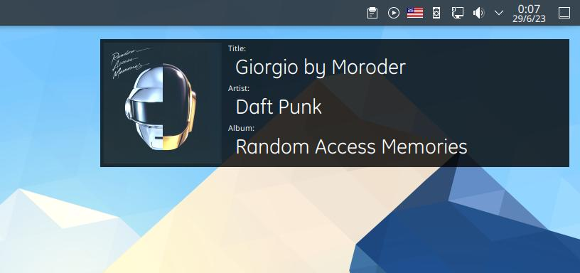
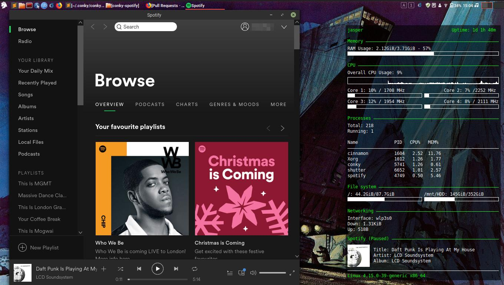

# Conky-Spotify

Conky-Spotify shows current Spotify track in Conky (title, artist, album, cover...).

## Screenshots

### Default setup

### Small Setup

## Install

To install Conky-Spotify:

    wget -O conky-spotify https://codeload.github.com/Madh93/conky-spotify/zip/master
    unzip conky-spotify
    mv conky-spotify-master ~/.conky/conky-spotify

## Useful Links

- [Conky](https://github.com/brndnmtthws/conky)

## License

This project is licensed under the [GNU GPL v3 license](LICENSE).
